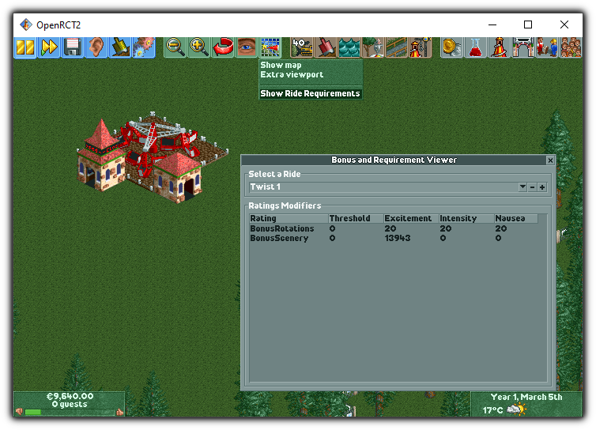

# Ride Bonus and Requirements Viewer (OpenRCT2)

This is a small plugin that shows the bonuses and requirements of a rides in
the game.

> [!WARNING]
> I made this mostly to test if my contribution (OpenRCT2/OpenRCT2#23354)
> to OpenRCT2 is working. That contribution is a the binding of
> `RideTypeDescriptor`, `RideRatingsDescriptor` and `RatingsModifier` to
> the scripting API.
> That contribution isn't available in OpenRCT2, and may never be (see PR)

